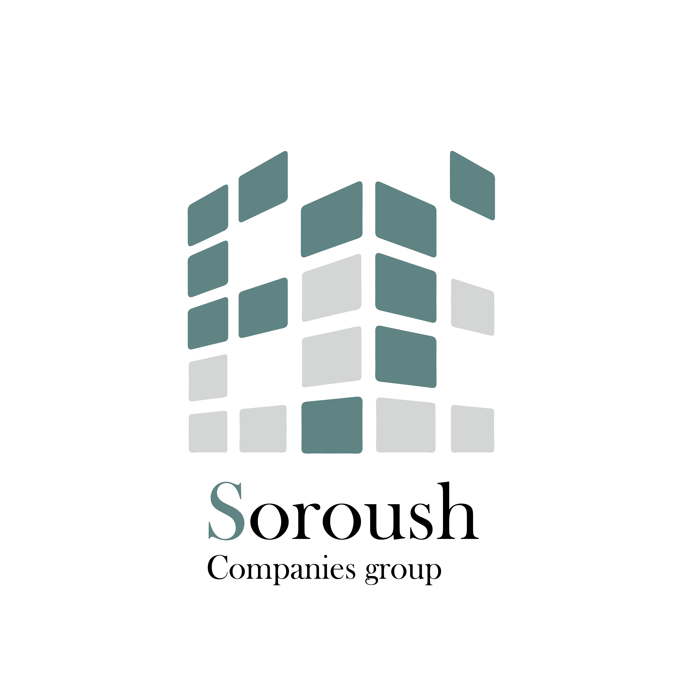

<p align="center">
  
</p>

<h1 align="center">
  🏗️ Soroush Companies group
</h1>

<p align="center">
  Modern Architecture • Engineering • Project Management
</p>

<p align="center">
  A premium digital experience built to showcase architectural excellence,
  engineering expertise, and execution-driven project delivery.
</p>

<div align="center">


</div>

---

## 📖 About

**Soroush Group** is a modern corporate website and architectural portfolio developed to present engineering services, architectural projects, technical capabilities, and company achievements through a refined and highly responsive user experience.

The platform combines contemporary design principles with modern web technologies to create a fast, scalable, and visually compelling digital presence.

---

## ✨ Highlights

### 🎨 Elegant Design System

- Clean and minimal interface
- Consistent visual language
- Reusable component architecture
- Carefully crafted typography

### 🏢 Project Showcase

- Featured project gallery
- Detailed project presentation
- Responsive image layouts
- Interactive project cards

### ⚡ Performance Focused

- Next.js App Router
- Optimized rendering
- Fast navigation
- Image optimization

### 📱 Fully Responsive

- Desktop experience
- Tablet support
- Mobile-first layouts

### 🌙 Modern Experience

- Dark Mode support
- Smooth transitions
- Interactive UI elements
- Accessible components

---

## 🛠 Tech Stack

### Frontend

| Technology         | Description     |
| ------------------ | --------------- |
| ▲ Next.js 16       | React Framework |
| ⚛️ React 19        | UI Library      |
| 🔷 TypeScript      | Type Safety     |
| 🎨 Tailwind CSS v4 | Styling         |

### UI & Components

| Library         | Purpose            |
| --------------- | ------------------ |
| 🧩 ShadCN UI    | Component System   |
| 🔲 Radix UI     | Accessibility      |
| ✨ Lucide React | Icon Library       |
| 🎭 React Icons  | Extended Icons     |
| 🏗️ CVA          | Variant Management |

### Utilities

| Package                        | Purpose             |
| ------------------------------ | ------------------- |
| 🔀 clsx                        | Conditional Classes |
| 🪄 tailwind-merge              | Class Merging       |
| 👀 react-intersection-observer | Viewport Detection  |
| 🆔 uuid                        | Unique Identifiers  |

---

## 🚀 Getting Started

### Clone Repository

```bash
git clone https://github.com/your-username/soroush-group.git
```

### Install Dependencies

```bash
npm install
```

### Run Development Server

```bash
npm run dev
```

Open:

```bash
http://localhost:3000
```

---

## 📦 Production Build

Build the application:

```bash
npm run build
```

Start production server:

```bash
npm run start
```

---

## 📸 Screenshots

### Home Page

> Add your screenshot here

```text
/public/screenshots/home.png
```

### Projects Page

> Add your screenshot here

```text
/public/screenshots/projects.png
```

### About Page

> Add your screenshot here

```text
/public/screenshots/about.png
```

---

## 🎯 Design Principles

The project is built around a few core ideas:

- 🎨 Simplicity
- ⚡ Performance
- 📱 Responsiveness
- ♿ Accessibility
- 🏗 Scalability
- ✨ User Experience

---

## 🌟 Key Features

- Responsive architecture
- Interactive project showcase
- Modern UI system
- Optimized images
- SEO-friendly structure
- Reusable component library
- Type-safe codebase
- Scalable folder architecture

---

## 📈 Roadmap

### Upcoming Improvements

- [ ] Project detail pages
- [ ] Project filtering system
- [ ] Multi-language support
- [ ] CMS integration
- [ ] Blog section
- [ ] Enhanced animations
- [ ] SEO optimization
- [ ] Contact form integration

---

## 🤝 Contributing

This project is currently maintained as a private company website.

For suggestions or improvements, please contact the project owner.

---

## ❤️ Built With

- ▲ Next.js
- ⚛️ React
- 🔷 TypeScript
- 🎨 Tailwind CSS
- 🧩 ShadCN UI
- ✨ Lucide React

---

<p align="center">
  <strong>Soroush Companies group</strong>
</p>

<p align="center">
  Architecture • Engineering • Construction
</p>

<p align="center">
  Made with ❤️ using Next.js & React
</p>
